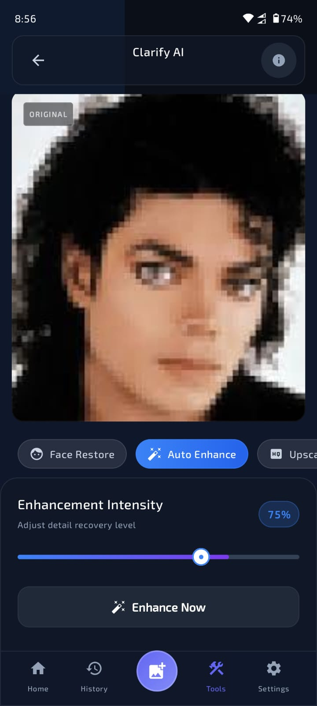

# Clarify AI SDK — On-Device Photo Enhancement for Android

<div align="center">


[](https://developer.android.com)
[](#-pricing)
[](https://play.google.com/store/apps/details?id=com.nsenterprise.clarify)

### The only Android SDK that enhances photos entirely on-device using GFPGAN + Real-ESRGAN.
### No server. No per-image cost. No privacy risk. Just one license key.

[📱 See Live Demo](https://play.google.com/store/apps/details?id=com.nsenterprise.clarify) &nbsp;•&nbsp; [💳 Get License](#-pricing) &nbsp;•&nbsp; [📖 Quick Start](#-quick-start)

</div>

---

## 💸 Stop Paying Per-Image API Costs

If you are using Replicate, Stability AI, or any cloud API to enhance photos, you are paying **$0.01–$0.05 per image**. That adds up fast:

| Monthly Active Users | Avg Enhancements | Cloud API Cost | **Clarify SDK Cost** |
|---|---|---|---|
| 1,000 users | 2/session | **$20–$100** | **$49** |
| 10,000 users | 2/session | **$200–$1,000** | **$49** |
| 100,000 users | 2/session | **$2,000–$10,000** | **$149** |

> *One license. Unlimited users. Unlimited enhancements. On the user's device.*

---

## ✨ What It Does

### 👤 Face Restoration (GFPGAN v1.4)
Restores heavily degraded, blurry, or compressed faces with studio-level clarity. Works on old scanned photos, low-resolution portrait shots, and heavily compressed images.

| Original | Enhanced |
|---|---|
|  |  |


### 🖼 4× Super-Resolution (Real-ESRGAN)
Upscales any photo up to 4× its original resolution while recovering micro-details, skin textures, and sharpness that were never visible before.

| Original | Enhanced (4×) |
|---|---|
|  |  |


### 🎨 Intelligent Face Blending
Advanced feathered-mask technology blends each restored face seamlessly back into the upscaled background. Users can't tell AI was involved.

### 🔒 100% On-Device Privacy
No photo ever leaves the user's device. Every pixel is processed locally using TensorFlow Lite. Add this to your privacy policy and you're fully GDPR compliant.

---

## 📱 Live Demo

See exactly what your users will experience. Download the official Clarify app — built entirely on this SDK:

<div align="center">

[](https://play.google.com/store/apps/details?id=com.nsenterprise.clarify)

</div>

---

## ⚡ Quick Start

### Add to your project

```kotlin
// settings.gradle.kts
repositories {
    maven { url = uri("https://jitpack.io") }
}

// app/build.gradle.kts
dependencies {
    implementation("com.github.nsenterprise9865-stack:clarifysdk:1.0.0")
}
```

### Initialize with your license key

```kotlin
class MyApp : Application() {
    override fun onCreate() {
        super.onCreate()
        lifecycleScope.launch {
            ClarifySDK.initialize(this@MyApp, key = "clarify_live_YOUR_KEY")
        }
    }
}
```

### Enhance a photo

```kotlin
lifecycleScope.launch {
    val result = ClarifySDK.enhance(
        context = this,
        bitmap = originalBitmap,
        mode = ClarifySDK.EnhanceMode.AUTO  // AUTO | FACE_ONLY | UPSCALE_ONLY
    )
    imageView.setImageBitmap(result)
}
```

**Three functions. Zero servers. Production-ready.**

---

## 🔧 Technical Specs

| | |
|---|---|
| **Min SDK** | Android 8.0 (API 26) |
| **Architectures** | arm64-v8a, armeabi-v7a |
| **Runtime** | TensorFlow Lite / LiteRT 1.0.1 |
| **Face Detection** | Google ML Kit |
| **GFPGAN Model** | v1.4 FP16 (~169MB, downloaded once) |
| **ESRGAN Model** | Real-ESRGAN (~17MB, downloaded once) |
| **Avg Processing Time** | 2–5 seconds on mid-range devices |
| **Offline Support** | ✅ After first model download |

---

## 💳 Pricing

<div align="center">

| | **Indie** | **Business** |
|---|:---:|:---:|
| **Price** | **$49 / month** | **$149 / month** |
| **Apps** | 1 app | Unlimited apps |
| **Users** | Unlimited | Unlimited |
| **Processing** | Unlimited | Unlimited |
| **Email Support** | ✅ | ✅ Priority |
| **Updates** | ✅ | ✅ |
| | [**Buy Indie →**](mailto:nsenterprise9865@gmail.com?subject=Clarify%20SDK%20-%20Indie%20License%20Request) | [**Buy Business →**](mailto:nsenterprise9865@gmail.com?subject=Clarify%20SDK%20-%20Business%20License%20Request) |

</div>

> **How to buy:** Email [nsenterprise9865@gmail.com](mailto:nsenterprise9865@gmail.com) with your plan. You will receive a payment link and your license key within **24 hours**.

---

## 🛡️ Privacy & Compliance

- ✅ **No data collection** — zero telemetry or analytics in the SDK
- ✅ **No server calls** — all AI inference runs locally on the device
- ✅ **GDPR / CCPA ready** — photos never leave the user's device
- ✅ **No internet required** after initial model download

---

## ❓ FAQ

**Q: Do I need a Firebase account?**
A: Yes. The SDK uses Firebase Firestore (free plan) to validate your license key. Setup takes 5 minutes.

**Q: What happens if my user has no internet?**
A: The SDK caches a valid license for 7 days. Users can enhance photos fully offline after the first validation.

**Q: How large is the SDK itself?**
A: The SDK code is under 1MB. The AI models (~186MB total) are downloaded once on first use and stored in the app's private storage.

**Q: Can I use this in a free app?**
A: Yes. Your users don't need to pay anything. Only you (the developer) need the license.

**Q: What if I need a refund?**
A: Contact us within 7 days of purchase if the SDK does not work as described.

---

## 📬 Contact & Support

- **Email**: [nsenterprise9865@gmail.com](mailto:nsenterprise9865@gmail.com)
- **Issues**: Open an issue in this repository
- **Response time**: Within 24 hours

---

<div align="center">

**Built with ❤️ by [NS Enterprise](https://github.com/nsenterprise9865-stack)**

*Bangladesh 🇧🇩 • Powering beautiful Android apps with on-device AI*

</div>
